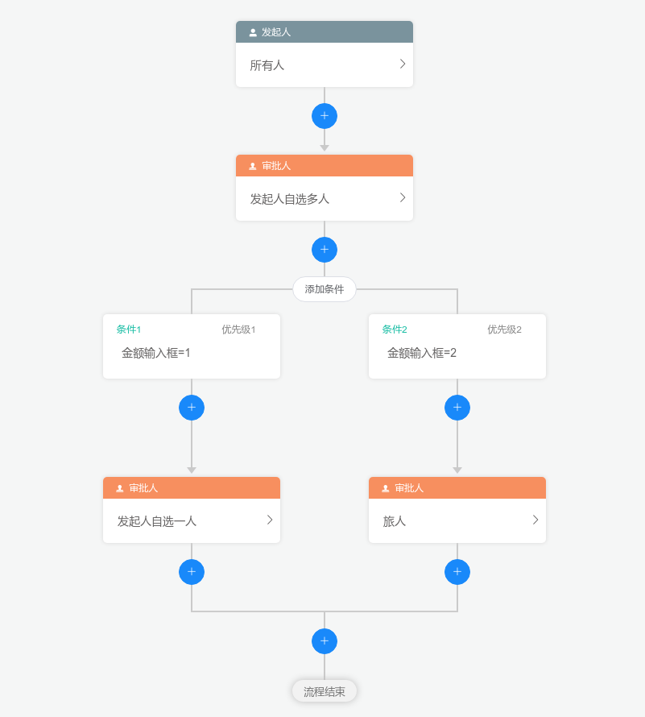

# 工作流绘图组件

```aidl

``` 
## 主要框架  

#### vue2 &nbsp;&nbsp;&nbsp;&nbsp;&nbsp;&nbsp;&nbsp; element-ui    

## Installation  

#### npm install

## Compiles and hot-reloads for development

#### npm run serve

## Compiles and minifies for production

#### npm run build

## 使用
 
#### 1、运行npm run build 打包项目生成dist文件，复制dist文件下的所有文件(可以不复制index.html文件)。放在使用项目的public文件下。并在使用项目的index.html文件中引入如下四个文件。
 
```
<script defer="defer" src="js/chunk-vendors.b6b642b9.js"></script>
<script defer="defer" src="js/app.d00df2f2.js"></script>
<link href="css/chunk-vendors.7c88cb4c.css" rel="stylesheet" />
<link href="css/app.b2f994af.css" rel="stylesheet" />
```
#### 2、在使用页面创建一个div标签如下。
 ```
<div id="workFlow" />
 ```
#### 3、需要展示页面时运行。
 ```
window.workflow.init();
 ```
#### 4、获取流程节点数据。
 ```
window.workflow.getData()
 ```

#### 5、审批流程回显
```
// process: 流程节点树状数据
window.workflow.initData = {formItems：[], process: {} }
```

#### 6、流程只读
```
window.workflow.infoStatus = 'view'
```

#### 7、获取人员(必传)
```
// userName:根据名字查询   deptId: 部门id,   type: dept(部门)||user(人员)||role(角色)
window.workflow.getPeoples = (userName, deptId, type) =>{
    // 返回参数格式
    return [{
        avatar: null
        id : "1486186"
        isLeader: null
        name: "xx科技有限公司"
        selected: null
        sex: null
        type: "dept"    // type:dept||user||role
    }]
}
```
#### 8、本地调试运行，在App.vue文件执行如下代码
```
window.workflow.init()
```

## 主要文件结构
```
src
    │  App.vue
    │  main.js
    │  
    ├─api
    │      org.js
    │      request.js
    │      
    ├─assets                          
    │  │  global.css                   全局样式
    │  │  theme.less                   主题颜色
    │  │  
    │  └─iconfont                      字体图标
    │          demo.css
    │          demo_index.html
    │          iconfont.css
    │          iconfont.js
    │          iconfont.json
    │          iconfont.ttf
    │          iconfont.woff
    │          iconfont.woff2
    │          
    ├─components                        组件
    │  ├─common                         公共组件
    │  │      Ellipsis.vue              文本超出省略组件
    │  │      InsertButton.vue          新增节点组件
    │  │      OrgPicker.vue             人员选择组件
    │  │      Tip.vue                   
    │  │      WDialog.vue               自定义弹窗组件
    │  │      
    │  ├─header
    │  │      LayoutHeader.vue
    │  │      
    │  ├─processNode                     工作流节点组件
    │  │      ApprovalNode.vue
    │  │      CcNode.vue
    │  │      ConcurrentNode.vue
    │  │      ConditionNode.vue
    │  │      DelayNode.vue
    │  │      EmptyNode.vue
    │  │      Node.vue
    │  │      RootNode.vue
    │  │      TriggerNode.vue
    │  │      
    │  ├─processNodeConfig               工作流节点对应数据编辑组件
    │  │      ApprovalNodeConfig.vue
    │  │      CcNodeConfig.vue
    │  │      ComponentsConfigExport.js
    │  │      ConditionGroupItemConfig.vue
    │  │      ConditionNodeConfig.vue
    │  │      DelayNodeConfig.vue
    │  │      FormAuthorityConfig.vue
    │  │      NodeConfig.vue
    │  │      RootNodeConfig.vue
    │  │      TriggerNodeConfig.vue
    │  │      
    │  └─processTree
    │          DefaultNodeProps.js       工作流节点绘制的配置文件
    │          OrgItems.vue              节点内容选中人员显示组件
    │          ProcessTree.vue           工作流节点绘制页面
    │          
    ├─store
    │      index.js                      vuex数据存储
    │      
    ├─utils
    │      CustomUtil.js                 公共方法
    │      
    └─views
            index.vue                    工作流组件主页面
```